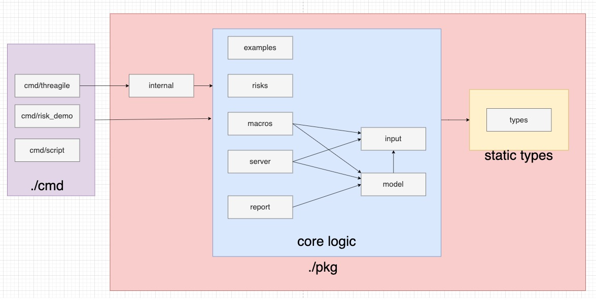

# Contributing to Threagile

:+1::tada: First of all, thanks for taking the time to contribute! :tada::+1:

All your contributions are very welcome, whether it's:

- Reporting a bug
- Discussing the current state of the code
- Submitting a fix
- Proposing new features
- Becoming a maintainer

Thank you so much! :clap:

## Development

Before running the project please install

- [go 1.21.0](https://go.dev/doc/install)
- [Docker](https://docs.docker.com/engine/install/)
- [pre-commit](https://pre-commit.com/)
- [golangci-lint](https://golangci-lint.run/usage/install/#local-installation)
- [goimports](https://pkg.go.dev/golang.org/x/tools/cmd/goimports)

Main program is [threagile](./cmd/threagile/main.go).

### Development with Visual Studio Code

To run the code with VS Code add launch.json with this content and simply use ```Run -> Start Debugging```/```Run -> Start Without Debugging```:

```
{
    "version": "0.2.0",
    "configurations": [
        {
          "name": "Launch Threagile",
          "type": "go",
          "request": "launch",
          "mode": "debug",
          "console": "integratedTerminal",
          "program": "${workspaceFolder}/cmd/threagile",
          "args": [
            "help",
            "--config",
            "./config.json",
          ]
        }
    ]
}
```

Where  config.json

```
{
    "appFolder": "/Users/Yevhen.Zavhorodnii/app",
    "tempFolder": "./",
    "diagramDPI": 96,
    "inputFile": "./threagile.yaml",
    "ignoreOrphanedRiskTracking": true,
    "verbose": true
}
```

Where

```directory_with_support_files``` is a directory where support files are located:

```
app/
├─ [background.pdf](./report/template/background.pdf)
├─ [LICENSE.txt](./LICENSE.txt)
├─ [live-templates.txt](./support/live-templates.txt)
├─ [openapi.yaml](./support/openapi.yaml)
├─ [schema.json](./support/schema.json)
├─ [threagile-example-model.yaml](./demo/example/threagile.yaml)
├─ [threagile-stub-model.yaml](./demo/stub/threagile.yaml)
```

## Packages structure

After recent efforts on modularization the code those packages was added:

- ***cmd*** - contains programs which runs
  - threagile - the main program, documentation about can be found at main [readme](./README.md)
  - risk_demo - demo risk program which is demonstrating how to create custom risk rules
  - script - util program to test script rule against your model
- ***pkg*** - reused part
  - internal - details on how to run the application as part of cobra application and configuration
  - types - simple structs (except [parsedModel](./pkg/types/model.go) which needs to be moved to [model](./pkg/model) package as soon as cross circular dependencies will be solved)
  - examples - logic for generating useful examples for end user (like example or stub Threagile model)
  - risks - logic for risk (builtin and scripts) to be executed against model
  - macros - logic for macros logic ()
  - server - [gin server](https://gin-gonic.com/) to run some of commands via UI
  - report - logic to generate all kind of reports (JSON, PDF, Excel)
  - input - logic to read the model from file system
  - model - logic to analyze the model from package above (input)



Currently it is not expected that any extra references will be added to the current architecture, so if it appears that adding extra dependency (effectively if you need to draw any extra line to make model above to expect reality) highly likely it may 2 options: some violation of [SOLID](https://en.wikipedia.org/wiki/SOLID)(particularly [dependency inversion principle](https://en.wikipedia.org/wiki/Dependency_inversion_principle)) is happening or current architecture require rethinking. Please raise a pull request and discuss this with other contributors.


## Contribution

To contribute the code simply make changes and create pull request. There is no strict rules about pull requests format like [this](https://www.pullrequest.com/blog/writing-a-great-pull-request-description/) however please take into consideration:

- it is easy to understand what the code change is achieving and why it was added
- new change is covered with unit tests

Before commiting the code please install [pre-commit](https://pre-commit.com/) and run ```pre-commit install``` to ensure that checks are running every time before commit.
